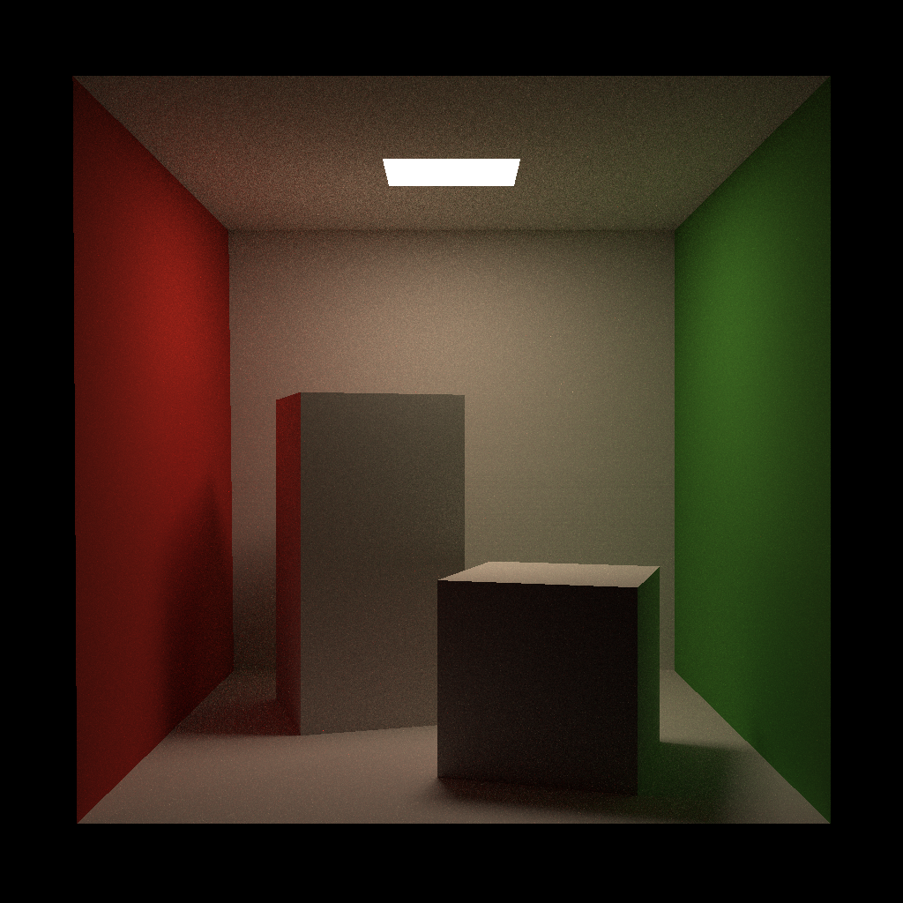

# Cinder
## What is Cinder?
Cinder is a ray-tracing renderer, which is used for learning different ray-tracing algorithm.

## Feature
### Path Tracer
For now Cinder has implemented a path tracer integrator.  
Here is a picture of Cornell Box rendered by path tracer.  
